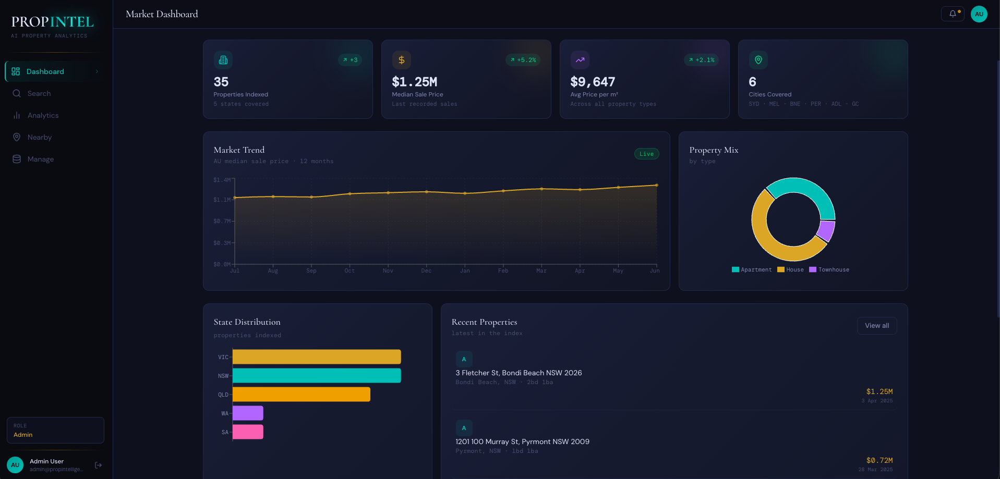

<div align="center">

# PropIntelligence

### AI-Powered Australian Property Analytics Platform

A production-grade full-stack application demonstrating **Clean Architecture backend**, **React/TypeScript frontend**, and **LLM AI integration** — built end-to-end as a single engineer.

[](https://dotnet.microsoft.com/)
[](https://learn.microsoft.com/en-us/dotnet/csharp/)
[](https://react.dev/)
[](https://www.typescriptlang.org/)
[](https://docs.mapbox.com/mapbox-gl-js/)
[](https://www.microsoft.com/en-au/sql-server/)
[](https://docs.docker.com/compose/)
[](https://xunit.net/)
[](LICENSE)

</div>

---

## Demo

<div align="center">
  <a href="https://www.youtube.com/watch?v=RUIFYrdqnQA">
    
  </a>
  <p><sub>▶ Click to watch — dashboard · map · AI search · AVM · suburb analytics · property management</sub></p>
</div>

---

## What This Project Demonstrates

This repo is a deliberate showcase of skills across three domains:

### Backend Engineering
- **Clean Architecture** with strict unidirectional dependency flow: `API → Application → Domain ← Infrastructure`
- **CQRS via MediatR** — every feature is a discrete command or query handler; zero coupling between them
- **Geospatial search** — Haversine distance formula with indexed bounding-box pre-filter (documented upgrade path to NetTopologySuite)
- **Automated Valuation Model (AVM)** — expanding-radius comparable-sales algorithm with High / Medium / Low / Insufficient confidence tiers, aligned to CoreLogic methodology
- **JWT authentication** with role-based access (Consumer · Agent · Admin); uniform auth error messages to prevent email enumeration
- **BCrypt** (work factor 12) with OWASP recalibration comment; documented RS256 + Key Vault production upgrade path
- **Unit tests** with xUnit + Moq + FluentAssertions; all external deps mocked via interfaces

### Frontend Engineering
- **React 18 + TypeScript** with strict typing end-to-end; API DTOs mirrored exactly from backend
- **Interactive Mapbox GL** map — coloured markers by property type, hover price bubbles, animated pulse rings, radius circle overlay, slide-up property panel
- **Data visualisation** — Recharts area/bar/donut charts for market trends, median price over time, property type breakdown
- **"Data Noir" design system** — custom Tailwind config; Cormorant serif display + DM Mono tabular data font; deep navy / amber gold / electric teal palette
- **Persistent JWT auth** with React Context, auto-logout on 401, role badge in sidebar
- Five distinct pages: Dashboard · Search · Property Detail · Suburb Analytics · Nearby Search · Property Management

### AI Integration
- **Natural language property search** via OpenRouter LLM — queries like *"3-bed house in Melbourne under $1.5M near good schools"* are parsed by the model into structured filters and fed into the existing search pipeline
- Prompt engineering for reliable structured JSON extraction; robust fallback when the model output is malformed
- AI layer is cleanly abstracted behind an interface — swappable between OpenRouter, OpenAI, or any other provider

---

## Tech Stack

| Layer | Technology |
|---|---|
| API | ASP.NET Core 8, C# 12 |
| Architecture | Clean Architecture, CQRS (MediatR 12) |
| Database | EF Core 8, SQL Server 2022 (code-first migrations) |
| Auth | JWT HS256, BCrypt wf=12 |
| AI | OpenRouter API (LLM natural language → structured query) |
| Frontend | React 18, TypeScript 5.6, Vite |
| Styling | Tailwind CSS (custom design system) |
| Maps | Mapbox GL JS via react-map-gl |
| Charts | Recharts |
| Testing | xUnit, Moq, FluentAssertions |
| DevOps | Docker Compose (one-command full stack) |

---

## Quick Start

**Prerequisite:** [Docker Desktop](https://www.docker.com/products/docker-desktop/) — no local .NET SDK or SQL Server needed.

```bash
git clone https://github.com/<your-username>/prop-data-iq.git
cd prop-data-iq

cp .env.example .env
# Edit .env — set SA_PASSWORD, JWT_SECRET, ADMIN_EMAIL, ADMIN_PASSWORD

docker compose up -d --build
```

On first start (~20 s): SQL Server becomes healthy → EF Core migrations run → 35 AU properties seeded → admin account created.

| Service | URL |
|---|---|
| **Swagger UI** | `http://localhost:5050/swagger` |
| **API** | `http://localhost:5050/api` |

**Frontend (dev mode):**

```bash
cd frontend
cp .env.example .env   # add VITE_MAPBOX_TOKEN
npm install && npm run dev   # → http://localhost:3000
```

For full setup details, migrations, and local SDK instructions → [Developer Guide](docs/DEVELOPER_GUIDE.md).

---

## Architecture Overview

```
┌─────────────────────────────────────────┐
│     React / TypeScript  (port 3000)     │
│  Vite · Tailwind · react-map-gl · AI    │
└──────────────────┬──────────────────────┘
                   │  JWT Bearer
┌──────────────────▼──────────────────────┐
│      ASP.NET Core 8 API  (port 5050)    │
│  Properties · Suburbs · Auth · AI       │
└────────┬────────────────────┬───────────┘
         │  MediatR CQRS      │
┌────────▼────────────────────▼───────────┐
│         Application Layer               │
│  Commands  ·  Queries  ·  GeoUtils      │
│  Interfaces  ·  DTOs  ·  PagedResult    │
└────────┬────────────────────┬───────────┘
         │                    │
┌────────▼──────┐   ┌─────────▼──────────┐
│  EF Core 8    │   │  Auth + AI Layer   │
│  SQL Server   │   │  JWT · BCrypt      │
│  4 Repos      │   │  OpenRouter LLM    │
│  Migrations   │   └────────────────────┘
│  DataSeeder   │
└───────────────┘
       ▲
PropIntelligence.Domain — zero external deps
Property · SalesHistory · Listing · User
```

---

## Interesting Problems Solved

**AVM with real confidence scoring** — rather than a simple average, the valuation handler runs an expanding-radius search (1 → 2 → 5 km), filters by comparable property type and bedroom count, takes the median price-per-sqm (outlier-robust), and classifies confidence based on comp count, distance, and recency — matching published CoreLogic methodology.

**LLM → structured search pipeline** — the AI endpoint accepts freeform text, sends it to an LLM with a carefully engineered prompt that returns a JSON filter object, then hands that object directly to the existing `SearchProperties` query handler. The LLM adds a UI layer; the search engine is unchanged.

**Geospatial without a GIS dependency** — lat/lon stored as indexed doubles; Haversine runs in the Application layer on a bounding-box pre-filtered candidate set, keeping Docker images and CI pipelines simple while staying accurate to ~0.5% at suburb scale.

---

## Seeded Data

35 properties across Sydney, Melbourne, Brisbane, Gold Coast, Adelaide, and Perth — realistic AU addresses, coordinates, sales history, and active listings. Two properties have no sales history to exercise the "Insufficient Data" AVM path.

---

[Developer Guide →](docs/DEVELOPER_GUIDE.md)
